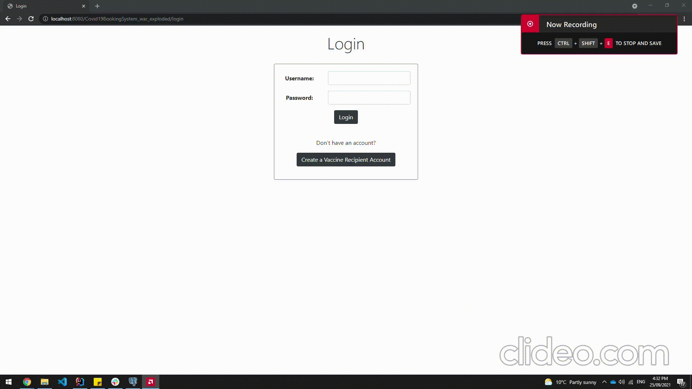

# Usage Instructions #

## Use Case 1: Creating new Vaccine Recipient ##
To create a new vaccine recipient,
1. Click on the "Create a Vaccine Recipient Account" button on the login screen (The same button exists in the admin's home page as well).
2. Fill in all the details in the form.
3. Click on "Create Account"

