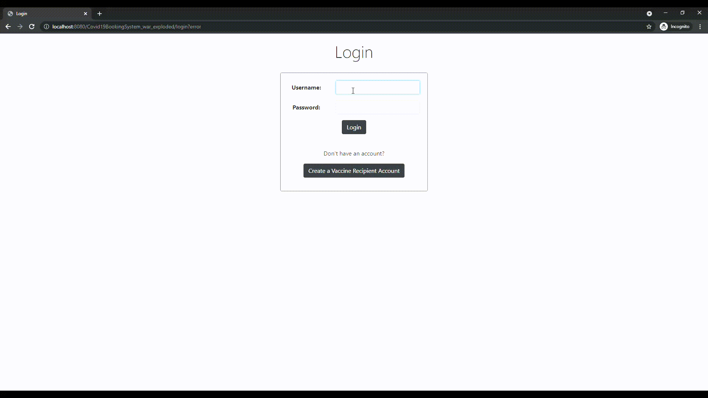

# Usage Instructions #

## Use Case 1: Creating a new Vaccine Recipient ##
To create a new vaccine recipient,
1. Click on the "Create a Vaccine Recipient Account" button on the login screen (The same button exists in the admin's home page as well).
2. Fill in all the details in the form.
3. Click on "Create Account".

## Use Case 2: Booking a Timeslot ##
To book a vaccine timeslot,
1. Log in as a vaccine recipient.
2. Click on "Book Timeslot".
3. Choose "Vaccine Type" from the dropdown list and click "Next".
4. Answer the yes/no questions to determine eligibility for the vaccine and click "Next".
5. Search by Health Care Provider name or Timeslot area postcode and enter the postcode/name into the input box. Finally, click "Search" to proceed.
6. Click on a date that has the label "Available" in it, and click on "Proceed".
7. Choose an available time from the list and click on it.
8. Finally, if you want to book the vaccine, click on "Book Vaccine"

## Use Case 3: View acquired Vaccine Certificates ##
To view vaccine certificates received,
1. Log in as a vaccine recipient.
2. Click on "View Vaccine Certificates" (this may redirect you to a failure page in the case that no vaccine certificates are registered in your name).
3. You can view all the vaccine certificates you have received.

