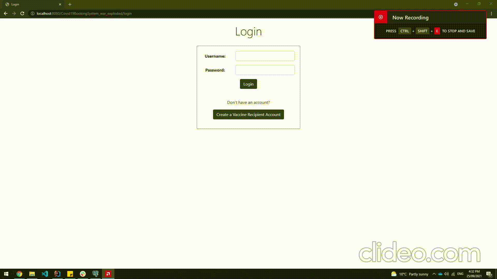
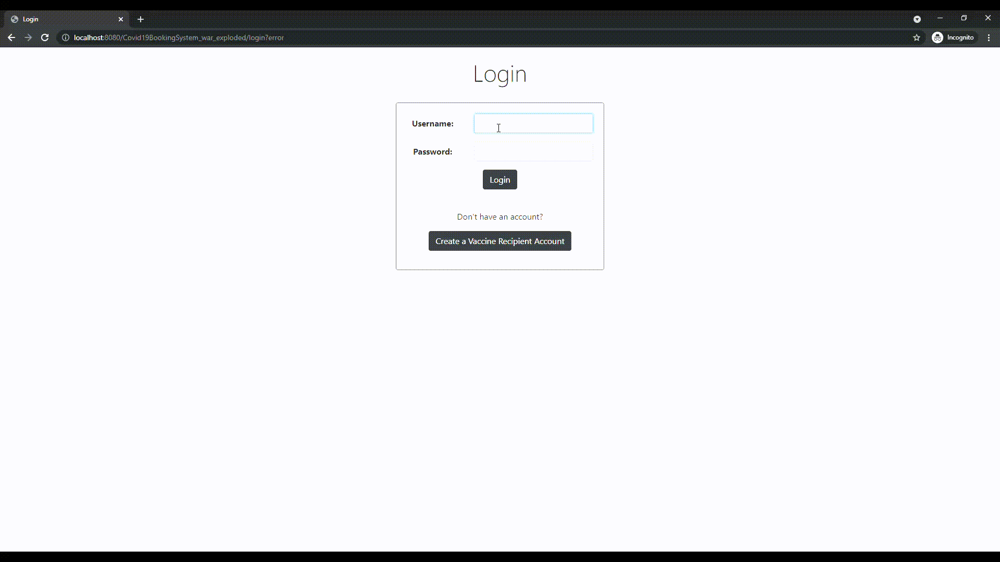
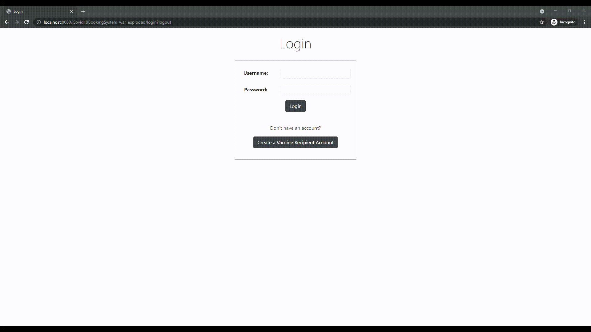

# Usage Instructions #

### *Note*: Open the "Data Samples and Test Cases" document alongside this document as both are required to test the system. ###

## TC01: Creating a new Vaccine Recipient ##
To create a new vaccine recipient,
1. Click on the "Create a Vaccine Recipient Account" button on the login screen (The same button exists in the admin's home page as well).
2. Fill in all the details in the form.
3. Click on "Create Account".

## TC02: Booking a Timeslot ##
To book a vaccine timeslot,
1. Log in as a vaccine recipient.
2. Click on "Book Timeslot".
3. Choose "Vaccine Type" from the dropdown list and click "Next".
4. Answer the yes/no questions to determine eligibility for the vaccine and click "Next".
5. Search by Health Care Provider name or Timeslot area postcode and enter the postcode/name into the input box. Finally, click "Search" to proceed.
6. Click on a date that has the label "Available" in it, and click on "Proceed".
7. Choose an available time from the list and click on it.
8. Finally, if you want to book the vaccine, click on "Book Vaccine"

## TC03: View acquired Vaccine Certificates ##
To view vaccine certificates received,
1. Log in as a vaccine recipient.
2. Click on "View Vaccine Certificates" (this may redirect you to a failure page in the case that no vaccine certificates are registered in your name).
3. You can view all the vaccine certificates you have received.

## TC04: Add a Timeslot ##
To add a vaccine timeslot,
1. Log in as a health care provider.
2. Click on "Add Timeslot".
3. Fill out all the timeslot details.
4. Click on "Add Timeslot" to add this timeslot. Once clicked, an empty timeslot details page will appear.
5. If more timeslots are desired, repeat steps 3 and 4.
6. When finished adding all timeslots, click on "Submit All Timeslots" to submit all your newly created timeslots.

## TC05: Record a completed vaccination ##
To recorded a completed vaccination,
1. Log in as a health care provider.
2. Click on "Record Completed Vaccination". You will be directed to a detailed list showing all unrecorded vaccinations for this health care provider.
3. Click on the vaccination you wish to record. This vaccination entry will then disappear from the list as it is now set to recorded.

## TC06: Create a Health Care Provider Account ##
To create a Health Care Provider Account,
1. Log in as an Admin.
2. Click on "Create Health Care Provider Account". 
3. Fill in details of the Health Care Provider Account.
4. Click on "Create Account" to confirm the creation of the account.

## TC07: Create a Vaccine Recipient Account (Admin) ##
To create a Vaccine Recipient Account as an Admin,
1. Log in as an Admin.
2. Click on "Create Vaccine Recipient Account".
3. Fill in details of the Vaccine Recipient Account.
4. Click on "Create Account" to confirm the creation of the account.

## TC08: Add a Vaccine Type  ##
To add a Vaccine Type to the system,
1. Log in as an Admin.
2. Click on "Add Vaccine Type".
3. Fill in the name of the Vaccine Type.
4. To create Eligibility Questions for the Vaccine Type, click on "Add Question".
5. Fill in the question and the "Success Answer" that is a boolean answer {YES/ NO}. A Vaccine Recipient will only be 
considered eligible for this Vaccine Type if answers to all questions match their respective success answers.
6. Click on "Submit Vaccine Type" to confirm the creation of the new Vaccine Type.

## TC09: View All Users ##
To view all users in the system,
1. Log in as an Admin.
2. Click on "View All Users".
3. To apply filters to view different types of users, select the desired filter from the "Filter by:" menu, then click on "Filter" to view the filtered list of users.

## TC10: View All Available Timeslots ##
To view all available Timeslots,
1. Log in as an Admin.
2. Click on "View All Available Timeslots" to view list of available Timeslots.

