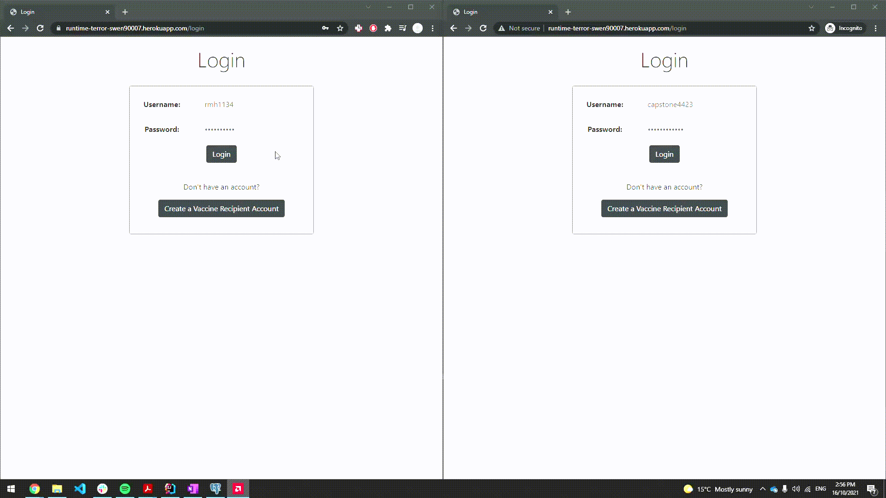

# Concurrency Examples #

### *Note*: Open the "Data Samples and Test Cases" document alongside this document as both are required to test the system. ###

## TC01: Book Timeslot Concurrency ##
1. Open two or more tabs (incognito) and log in with multiple users.
2. Navigate to the book timeslot page, and choose the same vaccine type for all the users.
3. Fill out the questionnaire and proceed to the search page.
4. Enter the same search query for all the users.
5. On the calendar view, proceed to select the same timeslot for all the users, and navigate to the confirmation page. 
6. Click ‘Book Timeslot’ on all the timeslots at the same time.

The expected result is only one of the multiple users should be redirected to a success page. The rest of the users should be redirected to the search timeslot page with an error message describing that another user has already booked the timeslot.

## TC02: Edit Timeslots Concurrency ##
1. Open two or more tabs (incognito).
2. Login with different HealthCareProvider accounts from the same organisation (same organisational Id). 
3. Navigate to the 'Edit Timeslots' on all tabs through which you should be able to see all the timeslots from the future from all healthcare providers in your organisation. 
4. On all tabs, attempt to click on (open) the same timeslot. 
5. The editing pop-up will only open up for one of the users (only one of the tabs), whereas the rest will be sent to an error screen indicating that another user is currently editing the timeslot.

Only one user can successfully open the edit timeslot pop-up for a given timeslot at a time. For the entire duration of a user editing a given timeslot, all the other users are sent to an error page indicating that another user is currently editing the timeslot and they would have to try again later.

## TC03: Record Completed Vaccinations Concurrency ##
1. Open two or more tabs (incognito).
2. Login with different HealthCareProvider accounts from the same organisation (same organisational id). 
3. Navigate to the record completed timeslot page for both users, and choose the same timeslot to record it as complete. 
4. For the first user, the timeslot is removed as normal. 
5. For the other users, the timeslot is removed to indicate that it has been marked as completed and an error message is shown to indicate that this timeslot has already been recorded as completed.

Only one user can successfully record a timeslot as completed, the other users trying to record the same timeslot as complete are shown an error message.

## TC04: Create Accounts Concurrency ##
1. Open two or more tabs (incognito) and click on the 'Create Vaccine Recipient Account' button on all tabs.
2. Fill in the 'Username' field with an identical username and complete the form with the required information.
3. Fill in the rest of the form with arbitrary data.
4. Click ‘Create Account’ on all active tabs at the same time. The expected result is only one of the multiple users should be redirected to a success page. The rest of the users should be presented with an ‘username taken’ error, prompting them to create the account with a different username.

All users must create accounts with unique usernames. Users who attempt to create an account with a duplicate username will receive an error message and prompted to try again with a different username.

**Note**: The same steps can be used for the "Create new HealthCareProvider account" usecase.

